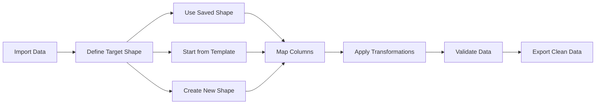

# Citrus Surf Importer Documentation

This directory contains comprehensive documentation for the Citrus Surf Importer system, a workflow-first CSV importer and data prep tool.

## 📚 Documentation Overview

### Core Systems

#### 🎯 Target Shapes System

- **[Target Shapes](./target-shapes.md)** - Complete documentation for the target shapes concept
- **[Target Shapes Quick Reference](./target-shapes-quick-reference.md)** - Concise guide and examples

**What are Target Shapes?** Target Shapes define the desired clean output format for data imports. They act as "molds" that transform messy data into consistent, validated formats.

#### 📥 Import System

- **[Import System](./import-system.md)** - How data import works (CSV, JSON, TSV)

#### 📤 Export System

- **[Export System](./export-system.md)** - Data export functionality and formats

#### ⏰ History System

- **[History System](./history-system.md)** - Undo/redo and data versioning

#### 🏗️ Column System

- **[Column Types Reference](./column-types-reference.md)** - Available column types and their properties
- **[Column Sorting](./column-sorting.md)** - How column sorting works
- **[Column Abstraction Example](./column-abstraction-example.md)** - Example of column abstraction patterns
- **[Editable Cells](./editable-cells.md)** - In-place cell editing functionality

#### 🆔 ID System

- **[ID System](./id-system.md)** - Vendor-prefixed unique identifiers and row management

## 🎯 Target Shapes Integration

The Target Shapes system integrates with existing systems:

### Import → Define Target Shape → Export Flow



### Key Integration Points

1. **Import System** - Raw data is imported and analyzed
2. **Target Shape Selection/Creation** - User picks saved shape or creates new one (visual, no-code)
3. **Column Mapping** - Input columns mapped to target shape fields
4. **Transformation Engine** - Data cleaned and formatted
5. **Validation System** - Data validated against shape rules
6. **Export System** - Clean data exported in target format

## 🚀 Getting Started

### For New Users

1. Read **[Target Shapes Quick Reference](./target-shapes-quick-reference.md)** for a quick overview
2. Review **[Target Shapes](./target-shapes.md)** for complete understanding
3. Check **[Import System](./import-system.md)** to understand data import
4. Explore **[Export System](./export-system.md)** for output options

### For Developers

1. Start with **[Target Shapes](./target-shapes.md)** for system architecture
2. Review **[Column Types Reference](./column-types-reference.md)** for field types
3. Check **[Editable Cells](./editable-cells.md)** for UI patterns
4. Explore **[History System](./history-system.md)** for state management
5. Understand **[ID System](./id-system.md)** for data integrity and row management

## 🔄 System Relationships

### Target Shapes and Existing Systems

| System         | Integration Point  | Description                                          |
| -------------- | ------------------ | ---------------------------------------------------- |
| **Import**     | Data Source        | Raw data becomes input for shape mapping             |
| **Columns**    | Field Types        | Target shape fields use column type system           |
| **Validation** | Data Quality Rules | Shape validation integrates with existing validation |
| **History**    | Shape Versions     | Track changes to target shapes over time             |
| **Export**     | Output Format      | Clean data exported according to shape specification |

### Data Flow

```typescript
// 1. Import raw data
const rawData = importCSV("messy-data.csv");

// 2. Select or create target shape
const targetShape = selectOrCreateShape({
  // Option A: Use saved shape
  savedShapeId: "customer-db-v1",

  // Option B: Start from template
  templateId: "customer-template",

  // Option C: Create new shape (visual, no-code interface)
  newShape: {
    name: "Customer Database",
    fields: [
      { name: "customer_id", type: "string", required: true },
      { name: "email", type: "email", required: true },
      { name: "full_name", type: "string", required: true },
    ],
  },
});

// 3. Map columns to shape fields
const mapping = mapColumns(rawData.headers, targetShape.fields);

// 4. Transform and validate
const cleanData = transformAndValidate(rawData, targetShape, mapping);

// 5. Export clean data
exportCSV(cleanData, targetShape);
```

## 🎨 Design Principles

### Workflow-First

- Target shapes are defined **before** data import
- Clear expectations for data format
- Reusable templates for common use cases

### Transparency

- All transformations are visible and reversible
- Validation errors are clear and actionable
- Data lineage is tracked throughout the process

### Resilience

- No work lost during the transformation process
- Version control for target shapes
- Backup and recovery of shape definitions

### Speed

- Quick shape selection from templates
- Intelligent column mapping suggestions
- Fast validation and transformation

## 🔮 Future Enhancements

### Planned Features

- **Shape Templates** - Pre-built shapes for common data types
- **Shape Sharing** - Export/import shapes between users
- **Advanced Validation** - Cross-field validation rules
- **API Integration** - Direct import to external systems

### Integration Roadmap

- **Database Schemas** - Generate DB schemas from shapes
- **API Documentation** - Generate API docs from shapes
- **Testing** - Generate test data from shapes
- **Analytics** - Track shape usage and effectiveness

## 📝 Contributing

When adding new documentation:

1. **Follow existing patterns** - Use similar structure and formatting
2. **Include examples** - Provide practical code examples
3. **Update this README** - Add new docs to the overview
4. **Cross-reference** - Link to related documentation
5. **Test examples** - Ensure code examples work

## 🆘 Need Help?

- Check the **[Target Shapes Quick Reference](./target-shapes-quick-reference.md)** for common patterns
- Review **[Import System](./import-system.md)** for data import issues
- Explore **[Column Types Reference](./column-types-reference.md)** for field type questions
- See **[Editable Cells](./editable-cells.md)** for UI interaction patterns
